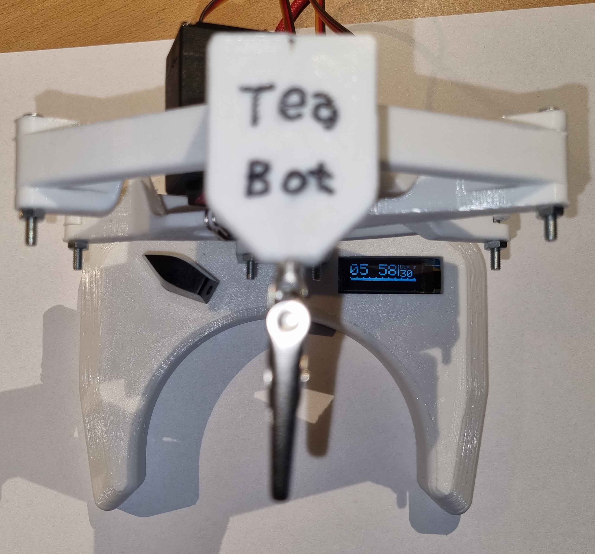

# Arduino TeaBot - automatic Tea Maker
The design uses the 3D model created by SnakeP (licensed under Creative Commons - Attribution, see link below). I adapted the TeaBot_Base to be able to fit the electronics inside it. This eliminates the need for a separate electronics enclosure. The parts `TeaBot_Arm_LH` and `TeaBot_Arm_RH` need to be printed two times each.

I removed the battery from the device, it is powered directly from the USB Type-C connector.

# Hardware

## parts list
- Arduino Nano
- OLED display I2C 128x32 with SSD1306 controller
- rotary encoder
- optional: Buzzer
- MG996R Servo
- 8 x M3x25mm screws
- 1 x M3x12mm screw
- 9 x M3 nuts (self locking)
- 1 x alligator clip
- 4x 3,0x12 screws

## Schematic

## 3D-printed parts
The 3D parts can be found in the folder [`3D`](3D).

# Software
The software can be found in the folder [`TeaBot_software`](TeaBot_software)

Key features:
- the rotary encoder is used to set the time, the time value is stored in the EEPROM of the Arduino, so at the next start the previous time value is restored
- Button operation: 
    - single click: start/stop
    - double click: enable/disable dipping (setting is stored in EEPROM), options: OFF, every 10 seconds, every 30 seconds
- Buzzer sound after timer expires

# References/Sources
- 3D model: https://www.thingiverse.com/thing:5250153
- used libraries are linked in the code
- OLED display example: https://www.instructables.com/Arduino-and-the-SSD1306-OLED-I2C-128x64-Display/

 

This work by Dustin Brunner is licensed under <a rel="license" href="https://creativecommons.org/licenses/by/4.0">CC BY 4.0</a>

 Dieses Werk von Dustin Brunner ist lizenziert unter einer <a rel="license" href="http://creativecommons.org/licenses/by/4.0/">Creative Commons Namensnennung 4.0 International Lizenz</a>.